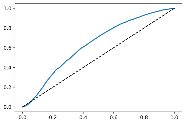
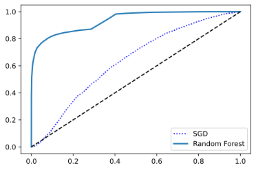
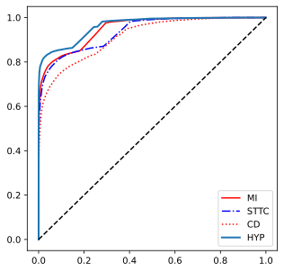

# 心电分类模型


```python
# 导入模块
import numpy as np
import matplotlib.pyplot as plt
```


```python
data_filepath = "../data/numpy_data/"

X_train = np.load(data_filepath + 'X_train.npy')
y_train = np.load(data_filepath + 'y_train.npy', allow_pickle=True)
X_test = np.load(data_filepath + 'X_test.npy')
y_test = np.load(data_filepath + 'y_test.npy', allow_pickle=True)

# reshape y_train, y_test
y_train = y_train.reshape(len(y_train), 1)
y_test = y_test.reshape(len(y_test), 1)
```


```python
def shuffle_train_test(X_train, y_train, X_test, y_test):
    shuffled_indices_x = np.random.permutation(len(y_train))
    shuffled_indices_y = np.random.permutation(len(y_test))

    return X_train[shuffled_indices_x], y_train[shuffled_indices_x], X_test[shuffled_indices_y], y_test[shuffled_indices_y]
```


```python
# 打乱数据
X_train, y_train, X_test, y_test = shuffle_train_test(X_train, y_train, X_test, y_test)
```

## 查看数据并调整数据格式

### 查看输入x和标签的维度是否匹配


```python
X_train.shape
```


    (16966, 500, 12)


```python
y_train.shape
```


    (16966, 1)


```python
X_test.shape
```


    (1901, 500, 12)


y_test.shape

### 将y映射为数组


```python
num2class = np.array(['NORM', 'MI', 'STTC', 'CD', 'HYP'])
```


```python
np.where(num2class == 'STTC')[0][0]
```


    2


```python
for index in range(len(y_train)):
    y_train[index] = np.where(num2class == y_train[index][0][0])[0]
```


```python
for index in range(len(y_test)):
    y_test[index] = np.where(num2class == y_test[index][0][0])[0]
```


```python
y_train = y_train.reshape(1, -1)[0].astype('uint8')
y_test = y_test.reshape(1, -1)[0].astype('uint8')
```


```python
y_test
```


    array([3, 0, 0, ..., 4, 1, 0], dtype=uint8)


## 数据集过采样

这里的心电数据样本存在样本不均衡的问题，所有的分类中正样本比例均显著低于负样本比例，如果采用欠采样的话会使训练集丢失部分数据，而过采样会导致一个数据点在高维空间出现多次，增加过拟合风险，很多研究通过在过采样中加入少量随机噪声来减少这类风险

这里需要安装`imblearn`包，使用以下的命令行安装

```shell
pip install imbalanced-learn
```


```python
from imblearn.over_sampling import SMOTE
```


```python
oversampler = SMOTE(random_state=42)

os_features, os_label = oversampler.fit_sample(X_train.reshape(len(X_train), 6000), y_train)
```


```python
os_features.shape
```


    (36080, 6000)


```python
os_label.shape
```


    (36080,)


```python
# 查看数据分布
plt.figure()
plt.hist(os_label)
plt.show()
```


    

    


## PCA降维


```python
from sklearn.decomposition import PCA
```

### 训练集PCA降维


```python
pca_train = PCA(n_components=240)
pca_train.fit(os_features)
```


    PCA(n_components=240)


```python
X_train_pca = pca_train.fit_transform(os_features)
```


```python
pca_train.explained_variance_ratio_.sum()
```


    0.9908215246322652


```python
X_train_pca.shape
```


    (36080, 240)


### 测试集PCA降维


```python
X_test_flatten = X_test.reshape(len(X_test), 6000)
pca_test = PCA(n_components=240)
pca_test = PCA(X_test_flatten)
```


```python
X_test_pca = pca_train.fit_transform(X_test_flatten)
```


```python
X_test_pca.shape
```


    (1901, 240)


## 训练模型 


```python
train_class = 2
print("---train class is %s---"%(num2class[train_class]))
y_train_norm = (os_label == train_class)
y_test_norm = (y_test == train_class)

# y_train_mi = (os_label == 1).reshape(1, -1)[0]
# y_test_mi = (y_test == 1).reshape(1, -1)[0]

# y_train_sttc = (os_label == 2).reshape(1, -1)[0]
# y_test_sttc = (y_test == 2).reshape(1, -1)[0]

# y_train_cd = (os_label == 3).reshape(1, -1)[0]
# y_test_cd = (y_test == 3).reshape(1, -1)[0]

# y_train_hyp = (os_label == 4).reshape(1, -1)[0]
# y_test_hyp = (y_test == 4).reshape(1, -1)[0]
```

    ---train class is STTC---


### 二分类模型


```python
from sklearn.linear_model import SGDClassifier
from sklearn.pipeline import Pipeline
from sklearn.preprocessing import StandardScaler, PolynomialFeatures
```


```python
# sgd_clf = Pipeline([
#     ("scaler", StandardScaler()),
#     ("sgd_clf", SGDClassifier(random_state=42))
# ])
sgd_clf = SGDClassifier(random_state=42)
sgd_clf.fit(X_train_pca, y_train_norm)
```


    SGDClassifier(random_state=42)


```python
y_predict_sgd = sgd_clf.predict(X_test_pca)
y_predict_sgd[0:10]
```


    array([False, False, False, False, False, False,  True, False, False,
           False])


```python
y_test_norm[0:10]
```


    array([False, False, False, False, False, False,  True,  True, False,
           False])


#### K折交叉验证


```python
from sklearn.model_selection import StratifiedKFold
from sklearn.base import clone

def k_fold_val(classifier, k_fold=5):
    skfolds = StratifiedKFold(n_splits=5, random_state=42, shuffle=True)
    fold = 1
    total_accu = 0
    for train_index, test_index in skfolds.split(X_train_pca, y_train_norm):
        clone_clf = clone(classifier)
        X_train_folds = X_train_pca[train_index]
        y_train_folds = y_train_norm[train_index]
        X_test_fold = X_train_pca[test_index]
        y_test_fold = y_train_norm[test_index]
        clone_clf.fit(X_train_folds, y_train_folds)
        y_pred = clone_clf.predict(X_test_fold)
        n_correct = sum(y_pred == y_test_fold)
        print("Fold %d accuracy: %f"%(fold, n_correct / len(y_pred)))
        fold += 1
        total_accu += n_correct / len(y_pred)
    print("\nTotal Accuracy: %f" % (total_accu/k_fold))

```


```python
k_fold_val(sgd_clf)
```

    Fold 1 accuracy: 0.783814
    Fold 2 accuracy: 0.784091
    Fold 3 accuracy: 0.778686
    Fold 4 accuracy: 0.777578
    Fold 5 accuracy: 0.789911
    
    Total Accuracy: 0.782816


```python
from sklearn.model_selection import cross_val_score
```


```python
cross_val_score(sgd_clf, X_train_pca, y_train_norm, cv=5, scoring="accuracy")
```


    array([0.78187361, 0.78395233, 0.78727827, 0.77896341, 0.62444568])


#### 查看混淆矩阵


```python
from sklearn.model_selection import cross_val_predict
from sklearn.metrics import confusion_matrix,precision_score, recall_score, f1_score
```


```python
y_train_pred_sgd = cross_val_predict(sgd_clf, X_train_pca, y_train_norm, cv=5)
confusion_matrix(y_train_norm, y_train_pred_sgd)
```


    array([[26350,  2514],
           [ 6459,   757]])


```python
precision_score(y_train_norm, y_train_pred_sgd)
```


    0.23142769795169674


```python
recall_score(y_train_norm, y_train_pred_sgd)
```


    0.10490576496674058


```python
f1_score(y_train_norm, y_train_pred_sgd)
```


    0.1443692190330886


#### ROC曲线


```python
from sklearn.metrics import roc_curve

y_scores_sgd = cross_val_predict(sgd_clf, X_train_pca, y_train_norm, cv=5,
method="decision_function")

fpr, tpr, thresholds = roc_curve(y_train_norm, y_scores_sgd)
```


```python
def plot_roc_curve(fpr, tpr, label=None):
    plt.plot(fpr, tpr, linewidth=2, label=label)
    plt.plot([0, 1], [0, 1], 'k--')
```


```python
from sklearn.metrics import roc_auc_score
roc_auc_score(y_train_norm, y_scores_norm)
```


    0.45509206759369425


```python
plot_roc_curve(fpr, tpr)
plt.show()
```


    

    


### 随机森林模型


```python
from sklearn.ensemble import RandomForestClassifier

forest_clf = RandomForestClassifier(random_state=42)
y_probas_forest = cross_val_predict(forest_clf, X_train_pca, y_train_norm, cv=5 ,method="predict_proba")
```


```python
y_scores_forest = y_probas_forest[:, 1]
fpr_forest, tpr_forest, threshold_forest = roc_curve(y_train_norm, y_scores_forest)
```


```python
plt.plot(fpr, tpr, "b:", label="SGD")
plot_roc_curve(fpr_forest, tpr_forest, "Random Forest")
plt.legend(loc="lower right")
plt.show()
```


    

    


```python
roc_auc_score(y_train_norm, y_scores_forest)
```


    0.9360270494767724


```python
y_train_pred = (y_scores_forest>=0.5)
```


```python
confusion_matrix(y_train_norm, y_train_pred)
```


    array([[28814,    50],
           [ 3491,  3725]])


```python
precision_score(y_train_norm, y_train_pred)
```


    0.9867549668874173


```python
recall_score(y_train_norm, y_train_pred)
```


    0.5162139689578714


```python
f1_score(y_train_norm, y_train_pred)
```


    0.6778273132563005


```python

y_scores_forest_all = []
for train_class in range(1,5):
    print("----training classifier for %s----"%(num2class[train_class]))
    y_train_norm = (os_label == train_class)

    forest_clf = RandomForestClassifier(random_state=42)
    y_probas_forest = cross_val_predict(forest_clf, X_train_pca, y_train_norm, cv=5 ,method="predict_proba")
    y_scores_forest = y_probas_forest[:, 1]
    y_train_pred = (y_scores_forest>=0.5)
    y_scores_forest_all.append(y_scores_forest)

    print("accuracy: %.3f" % np.mean(cross_val_score(forest_clf, X_train_pca, y_train_norm, cv=5, scoring="accuracy")))
    print("precision: %.3f" % precision_score(y_train_norm, y_train_pred))
    print("recall: %.3f" % recall_score(y_train_norm, y_train_pred))
    print("f1-score: %.3f" % f1_score(y_train_norm, y_train_pred))
    print("roc score: %.3f" % roc_auc_score(y_train_norm, y_scores_forest))
```

    ----training classifier for MI----
    accuracy: 0.904
    precision: 0.993
    recall: 0.535
    f1-score: 0.695
    roc score: 0.950
    ----training classifier for STTC----
    accuracy: 0.899
    precision: 0.987
    recall: 0.516
    f1-score: 0.678
    roc score: 0.936
    ----training classifier for CD----
    accuracy: 0.905
    precision: 0.911
    recall: 0.587
    f1-score: 0.714
    roc score: 0.914
    ----training classifier for HYP----
    accuracy: 0.940
    precision: 0.990
    recall: 0.720
    f1-score: 0.833
    roc score: 0.963


```python
line = ["","r-", "b-.", "r:", "b--"]
plt.figure()
plt.rcParams['figure.figsize'] = (5.0, 5.0)

for i in range(3):

    y_train_norm = (os_label == i + 1)
    fpr_forest, tpr_forest, threshold_forest = roc_curve(y_train_norm, y_scores_forest_all[i])

    plt.plot(fpr_forest, tpr_forest, line[i+1], label=num2class[i+1])

y_train_norm = (os_label == 4)
fpr_forest, tpr_forest, threshold_forest = roc_curve(y_train_norm, y_scores_forest_all[3])
plot_roc_curve(fpr_forest, tpr_forest, "HYP")
plt.legend(loc="lower right")
```


    <matplotlib.legend.Legend at 0x7fb2df1851d0>


    

    

